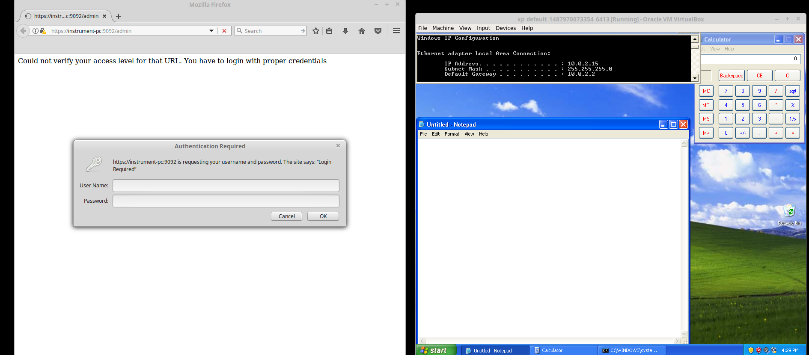
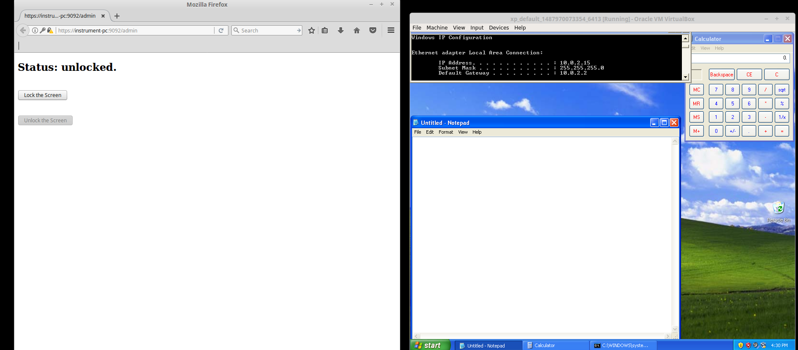
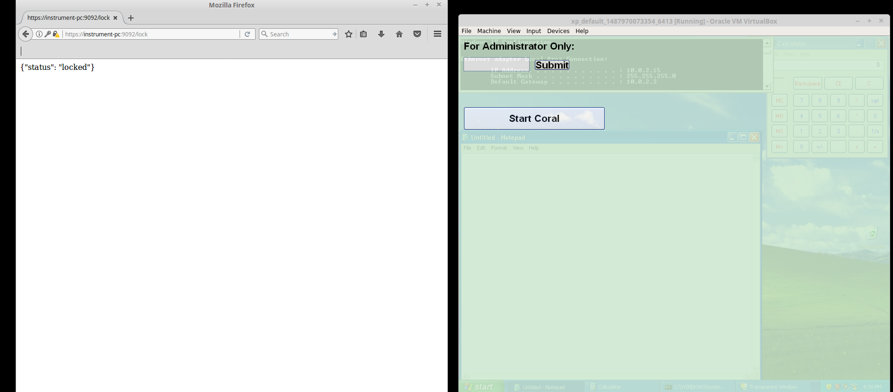
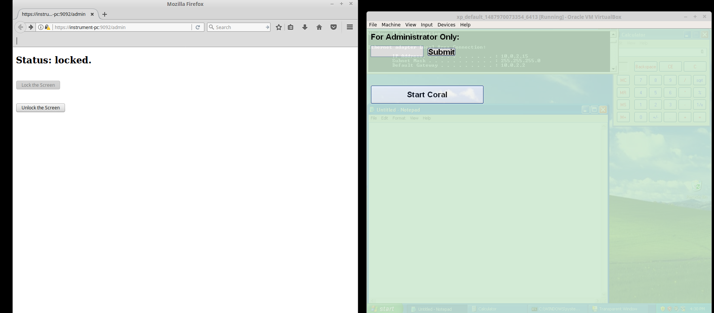
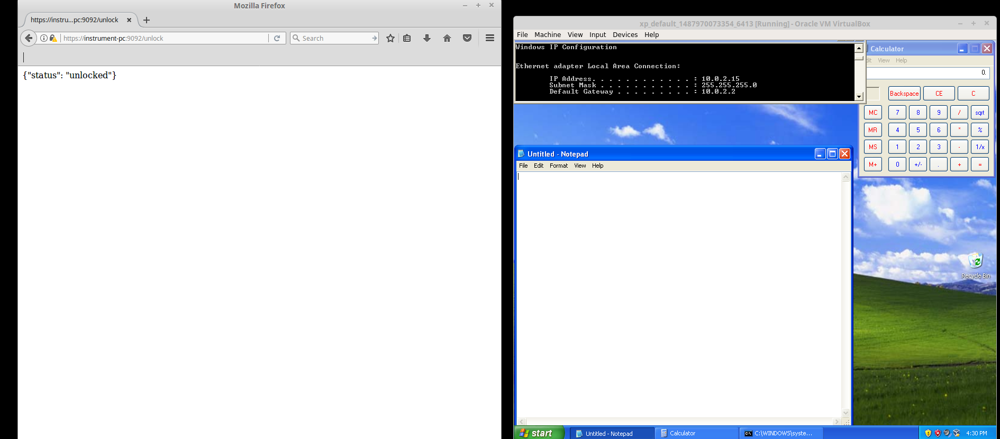
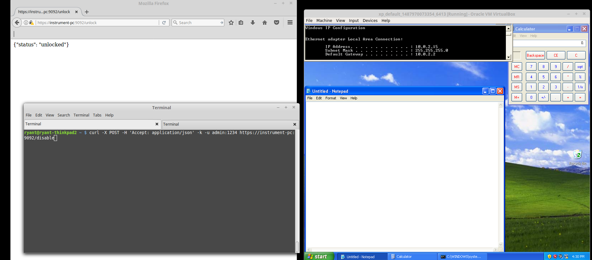
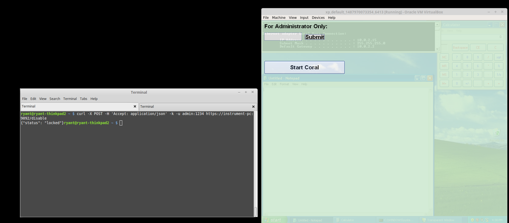
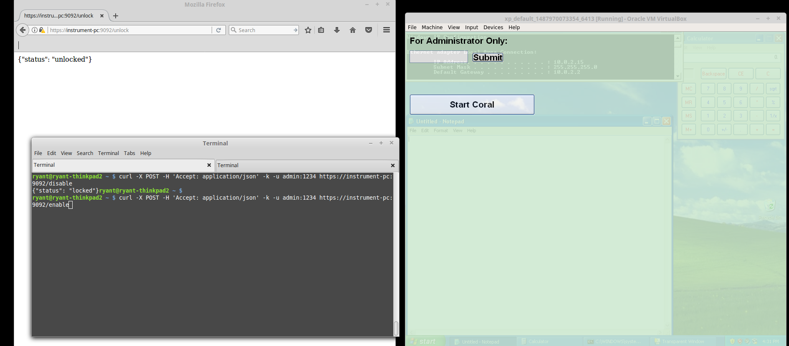
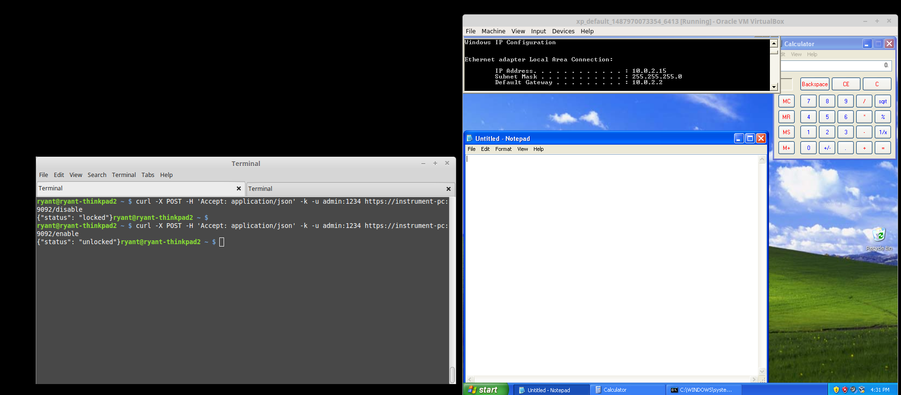

Examples
===
Here are some examples of using a browser from an admin's computer (left side) to control a locked computer (right side).

Open admin page:

Enter admin password page:

See that the controlled computer is currently unlocked:

Click "Lock the Screen" and get response (notice controlled computer is now locked):

Return to Admin screen and click "Unlock the Screen":

Get server response (notice controlled computer is now locked):

Same procedure using curl on the command line:

